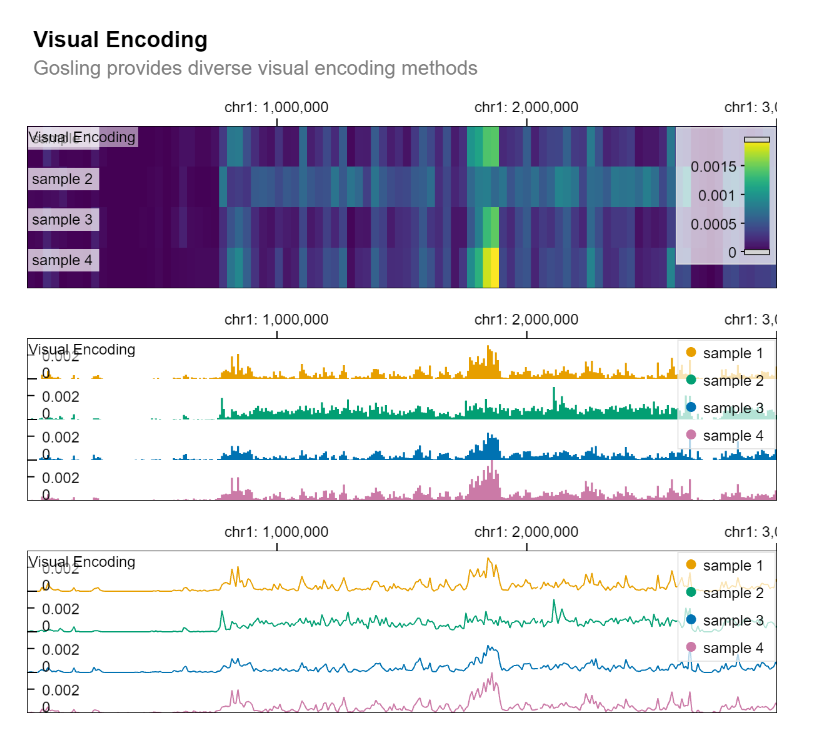
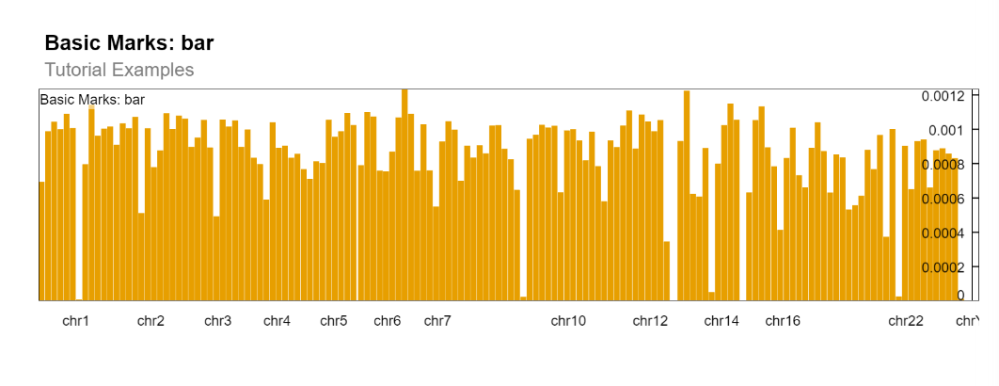
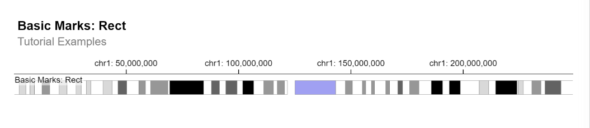
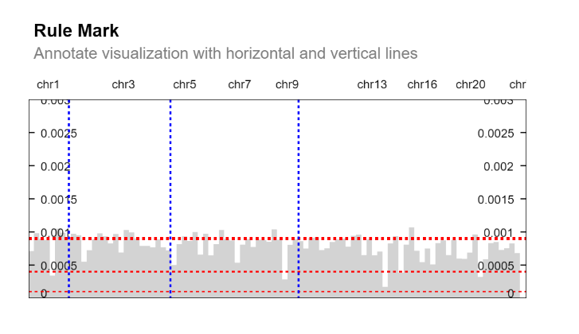

# Examples of specs and their textual generation

This folder contains examples of specs and the output that this automatic accessibility tool provides. 

_The alt-text in this markdown file was hand-written._

## Example 1

### Visual
Here is the visual itself:

**Figure 1:** Example Gosling figure displaying visual encodings

### Automatic description
The automatically generated description: 

> Long description: Gosling figure with title: 'Visual Encoding'. The subtitle reads: 'Gosling provides diverse visual encoding methods'. There are 3 subfigures. Subfigure 0 shows a plot marked with rect. The genomic field 'start' is shown on the x-axis. The genomic field 'end' is shown on the xe-axis. The nominal field 'sample' is shown on the row-axis. The quantitative field 'peak' is shown on the color-axis.
 Subfigure 1 shows a plot marked with bar. The genomic field 'position' is shown on the x-axis. The quantitative field 'peak' is shown on the y-axis. The nominal field 'sample' is shown on the row-axis. The nominal field 'sample' is shown on the color-axis.
 Subfigure 2 shows a plot marked with line. The genomic field 'position' is shown on the x-axis. The quantitative field 'peak' is shown on the y-axis. The nominal field 'sample' is shown on the row-axis. The nominal field 'sample' is shown on the color-axis.

## Example 2

### Visual
Here is the visual itself:

**Figure 2:** Example Gosling figure displaying bar chart

### Automatic description
The automatically generated description: 

> Long description: Gosling figure with title: 'Basic Marks: bar'. The subtitle reads: 'Tutorial Examples'. The figure shows a plot marked with bar. The genomic field 'start' is shown on the x-axis. The genomic field 'end' is shown on the xe-axis. The quantitative field 'peak' is shown on the y-axis.

## Example 3

### Visual
Here is the visual itself:

**Figure 3:** Example Gosling figure displaying ideogram

### Automatic description
The automatically generated description: 

> Long description: Gosling figure with title: 'Basic Marks: Rect'. The subtitle reads: 'Tutorial Examples'. The figure shows a plot marked with rect. The nominal field 'Stain' is shown on the color-axis. The genomic field 'chromStart' is shown on the x-axis. The genomic field 'chromEnd' is shown on the xe-axis.

## Example 4

### Visual
Here is the visual itself:

**Figure 4:** Example Gosling figure displaying bar chart with annotations

### Automatic description
The automatically generated description: 

> Long description: Gosling figure with title: 'Rule Mark'. The subtitle reads: 'Annotate visualization with horizontal and vertical lines'. The figure is an overlayed plot. Gosling's automatic text generation currently doesn't support overlayed plots.
